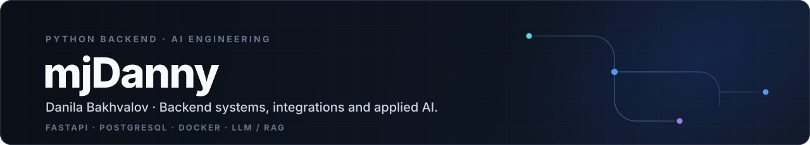

<div align="center">



<br/>

[](https://t.me/mjDanny)
[](mailto:bakhvalovfresh2014@gmail.com)

</div>

---

## 01 / About

Python backend developer focused on **APIs, data-heavy systems, integrations and applied AI**.

I like building software that connects real business processes instead of living as an isolated demo. Most of my work sits somewhere between backend architecture, external services, automation and AI-powered features.

```python
focus = {
    "backend": ["FastAPI", "AsyncIO", "REST APIs"],
    "data": ["PostgreSQL", "SQLAlchemy", "Alembic"],
    "ai": ["LLM", "RAG", "Vector Search"],
    "infra": ["Docker", "Linux", "CI/CD"],
}
```

---

## 02 / Engineering

<table>
<tr>
<td width="25%" valign="top">

### Backend
`Python`  
`FastAPI`  
`Flask`  
`AsyncIO`  
`Pydantic`

</td>
<td width="25%" valign="top">

### Data
`PostgreSQL`  
`SQLAlchemy`  
`Alembic`  
`MySQL`  
`SQLite`

</td>
<td width="25%" valign="top">

### AI / LLM
`RAG`  
`LangChain`  
`Vector Search`  
`LLM APIs`  
`Prompting`

</td>
<td width="25%" valign="top">

### Infra
`Docker`  
`Linux`  
`Git`  
`pytest`  
`CI/CD`

</td>
</tr>
</table>

<p align="center">
  
</p>

---

## 03 / Selected work

<table>
<tr>
<td width="50%" valign="top">

### Commercial B2B Platform `PRIVATE`

Backend and integration work for a production business system with real operational constraints.

**What I deal with:**  
API integrations · business logic · structured data · legacy interoperability · backend architecture

</td>
<td width="50%" valign="top">

### AI-powered product work

Backend functionality around LLM-powered user flows, external knowledge and application data.

**Areas:**  
RAG · vector retrieval · persistent context · APIs · automation

</td>
</tr>
</table>

### Public experiments

- [**AI PDF Reader**](https://github.com/mjDanny/ai_pdf_reader) — document-oriented AI experiment
- [**Fake News Detector**](https://github.com/mjDanny/fake_news_detector) — NLP / text classification
- [**Classification of City Administration Appeals**](https://github.com/mjDanny/classification_of_appeals_to_the_city_administration) — applied NLP classification

My public repositories include older experiments in backend, NLP, computer vision and ML. I keep them as a visible record of how my technical interests evolved toward production backend and AI systems.

---

## 04 / How I think about software

```text
business problem
      ↓
domain & data
      ↓
API / integration contract
      ↓
architecture
      ↓
implementation
      ↓
tests & operation
```

I use modern AI coding tools heavily, but as **engineering accelerators** — not as a substitute for understanding architecture, trade-offs and the system I'm responsible for.

> **I'm most interested in software where AI is part of the architecture, not the product pitch.**

---

## 05 / Current direction

<div align="center">

### Backend Systems × Applied AI × Automation

I want to build products where **APIs, databases, external services and AI models** work together as one system.

`Python Backend` → `Integration Design` → `AI Backend / LLM Engineering`

</div>

---

<div align="center">

### Let's build something useful.

[Telegram](https://t.me/mjDanny) · [Email](mailto:bakhvalovfresh2014@gmail.com) · [GitHub](https://github.com/mjDanny)

</div>
